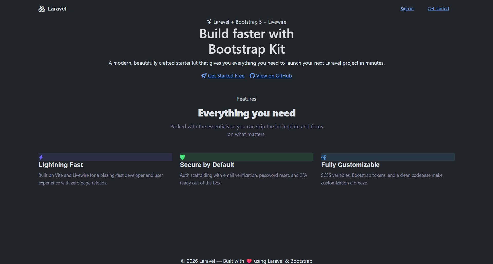

# ⚡ Bootstrap Starter Kit

A modern, beautifully crafted Laravel starter kit with **Bootstrap 5**, **Livewire**, and a **dark premium UI** — designed to help you ship your next project faster.


---

## ✨ Features

- 🎨 **Modern Dark Premium Theme** — custom CSS variables, gradient accents, and glassmorphism-style cards
- 🔐 **Full Auth Scaffolding** — Login, Register, Forgot Password, Reset Password, Email Verification, Confirm Password
- 📊 **Pre-built Dashboard** — stat cards, recent activity feed, quick actions panel, and system status widget
- 🗂️ **Sidebar Layout** — responsive collapsible sidebar with navigation, user dropdown, and mobile support
- ⚙️ **Settings Pages** — Profile, Password, Appearance (theme switcher), Delete Account
- 🌗 **Light/Dark Mode** — persisted theme preference via app settings
- 💅 **Custom Typography** — [Syne](https://fonts.google.com/specimen/Syne) for headings + [DM Sans](https://fonts.google.com/specimen/DM+Sans) for body text
- ⚡ **Livewire + Vite** — reactive UI components with zero full-page reloads
- 📱 **Fully Responsive** — mobile-first with Bootstrap 5 grid

---

## 🖼️ Screenshots

<div align="center">


</div>

---

## 🛠️ Tech Stack

| Layer | Technology |
|---|---|
| Framework | Laravel 12 |
| Frontend CSS | Bootstrap 5 + SCSS |
| Reactivity | Livewire 3 |
| Build Tool | Vite |
| Icons | Bootstrap Icons |
| Fonts | Google Fonts (Syne, DM Sans) |

---

## 🚀 Installation

### Requirements

- PHP `>= 8.2`
- Composer
- Node.js `>= 18` & NPM
- A supported database (MySQL, PostgreSQL, SQLite)

### Steps

```bash
# 1. Clone the repository
git clone https://github.com/your-username/bootstrap-starter-kit.git
cd bootstrap-starter-kit

# 2. Install PHP dependencies
composer install

# 3. Install Node dependencies
npm install

# 4. Copy environment file and generate app key
cp .env.example .env
php artisan key:generate

# 5. Configure your database in .env
# DB_CONNECTION=mysql
# DB_DATABASE=your_db
# DB_USERNAME=your_user
# DB_PASSWORD=your_password

# 6. Run migrations
php artisan migrate

# 7. Build assets
npm run build

# 8. Start the development server
php artisan serve
```

Then open [http://localhost:8000](http://localhost:8000) in your browser.

### Development (Hot Reload)

```bash
npm run dev
```

---

## 📁 Project Structure

```
resources/
├── css/
│   └── app.css              # Custom theme, sidebar, components
├── views/
│   ├── components/
│   │   └── layouts/
│   │       ├── app.blade.php        # Main app layout (sidebar + content)
│   │       ├── auth.blade.php       # Centered auth layout
│   │       ├── settings.blade.php   # Settings page layout
│   │       └── sidebar.blade.php    # Sidebar navigation component
│   ├── livewire/
│   │   ├── auth/                    # Auth views (login, register, etc.)
│   │   ├── settings/                # Profile, password, appearance, delete
│   │   └── dashboard.blade.php      # Main dashboard
│   └── welcome.blade.php            # Landing/welcome page
```

---

## 🎨 Theme Customization

All theme colors and design tokens are defined as CSS custom properties in `resources/css/app.css`:

```css
:root {
  --brand-primary:   #6C63FF;
  --brand-secondary: #FF6584;
  --brand-accent:    #43E97B;
  --sidebar-bg:      #0F0F1A;
  --card-bg:         #1A1A2E;
}
```

Gradients available out of the box:

```css
--gradient-purple: linear-gradient(135deg, #667eea, #764ba2);
--gradient-green:  linear-gradient(135deg, #43e97b, #38f9d7);
--gradient-pink:   linear-gradient(135deg, #f093fb, #f5576c);
--gradient-orange: linear-gradient(135deg, #4facfe, #00f2fe);
```

---

## 🔐 Auth Pages Included

- `/login` — Sign in
- `/register` — Create account
- `/forgot-password` — Request reset link
- `/reset-password` — Set new password
- `/verify-email` — Email verification prompt
- `/confirm-password` — Sudo / confirm password gate

---

## ⚙️ Settings Pages Included

| Page | Route |
|---|---|
| Profile | `/settings/profile` |
| Password | `/settings/password` |
| Appearance | `/settings/appearance` |
| Delete Account | `/settings/delete` |

---

## 🤝 Contributing

Contributions are welcome! Please open an issue or submit a pull request.

1. Fork the repository
2. Create your feature branch: `git checkout -b feature/my-feature`
3. Commit your changes: `git commit -m 'Add my feature'`
4. Push to the branch: `git push origin feature/my-feature`
5. Open a pull request

---

## 📄 License

This project is open-source and available under the [MIT License](LICENSE).

---

## 💜 Credits

Built with ❤️ using [Laravel](https://laravel.com), [Bootstrap 5](https://getbootstrap.com), and [Livewire](https://livewire.laravel.com).
